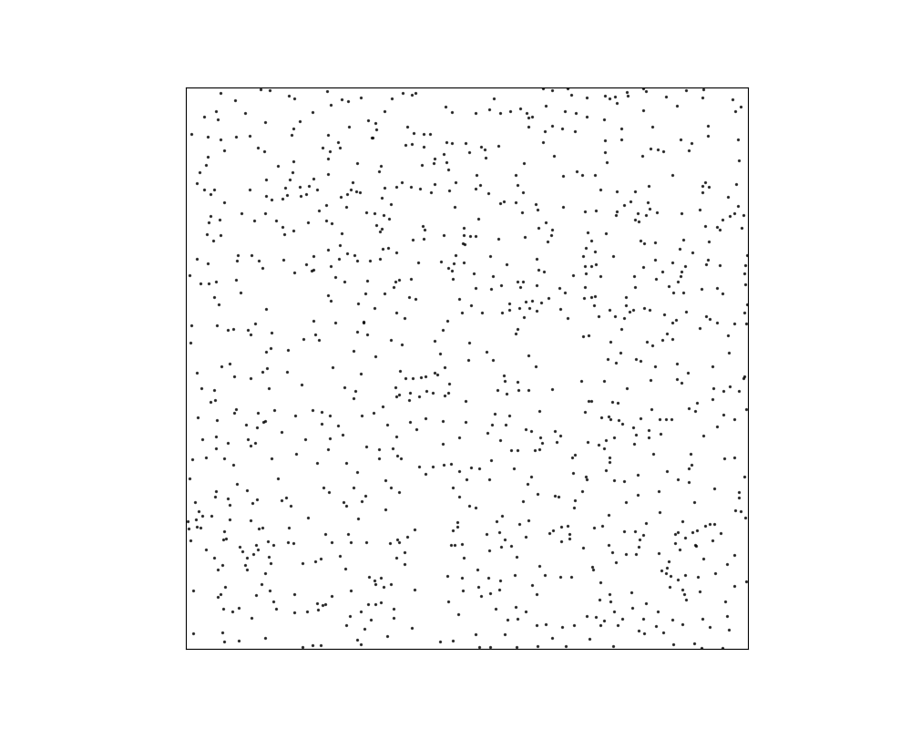

# Emergence of Collective Behaviour in Flocking Systems
\


---

## Table of Contents

1. [Project Overview](#project-overview)
2. [Repository Structure](#repository-structure)
3. [File Descriptions](#file-descriptions)
4. [Installation](#installation)
5. [Usage](#usage)
6. [Visuals](#visuals)
7. [Assets Details](#assets-details)
8. [Citation](#citation)
9. [Contributing](#contributing)
10. [License](#license)

---

## Project Overview

A computational capstone exploring how simple local rules (separation, alignment, cohesion) in a Reynolds‑style Boids model give rise to complex, global flocking behavior. This study investigates:

- **Noise‑induced phase transitions**
- **Integrator benchmarking** (Euler, Verlet, RK4)
- **Phase diagrams** over parameter space
- **Spatial correlation analysis**
- **Clustering dynamics** via DBSCAN

---

## Repository Structure

```
emergence-of-collective-behaviour/
├── code/                     # Python source files
│   ├── boids_simulation.py
│   ├── boids_phase_transition_analysis.py
│   ├── solver_comparison.py
│   ├── boids_phase_diagram.py
│   ├── boids_correlation_analysis.py
│   └── boids_clustering_analysis.py
├── assets/                   # Screenshots, plots & animations
│   ├── collective_motion.pdf
│   ├── weight_comparison.pdf
│   ├── periodic_boundaries_example.pdf
│   ├── Reynolds_rules.pdf
│   ├── kdtree.pdf
│   ├── numerical_accuracy.pdf
│   ├── order_param_vs_noise.pdf
│   ├── example_of_noise_effect.pdf
│   ├── heat_map.pdf
│   ├── low_noise.pdf
│   ├── high_noise.pdf
│   ├── dbscan.pdf
│   ├── cluster_distribution_low.pdf
│   ├── high_cluster.png
│   ├── velocity_corr.pdf
│   └── boids.gif
├── README.md                 # This file
├── LICENSE.md                # MIT License
└── CITATION.cff              # Citation file for academic use
```

---

## File Descriptions

- **boids\_simulation.py**\
  Implements the core Boids model with options for solver choice (Euler/Verlet/RK4), noise amplitude, perception radius, and output of static snapshots or animations.

- **boids\_phase\_transition\_analysis.py**\
  Sweeps the noise parameter η to compute the global order parameter ⟨ϕ⟩, identifies the critical noise ηc, and fits the scaling exponent β.

- **solver\_comparison.py**\
  Benchmarks integrators (Euler, Verlet, RK4) for accuracy (convergence order) and performance (runtime) on a standard flocking scenario.

- **boids\_phase\_diagram.py**\
  Generates phase diagrams mapping ordered vs. disordered regimes over a grid of (noise, perception radius).

- **boids\_correlation\_analysis.py**\
  Computes spatial velocity correlation functions C(r) and extracts correlation length ξ for various noise levels.

- **boids\_clustering\_analysis.py**\
  Applies DBSCAN to quantify cluster counts, size distributions, and fragmentation as a function of noise.

---

## Installation

1. **Clone the repository**

   ```bash
   git clone https://github.com/charliemunro/emergence-of-collective-behaviour.git
   cd emergence-of-collective-behaviour
   ```

2. **Create a virtual environment**

   ```bash
   python3 -m venv venv
   source venv/bin/activate
   ```

3. **Install dependencies**

   ```bash
   pip install numpy scipy matplotlib scikit-learn
   ```

---

## Usage

1. **Run a simulation**

   ```bash
   python code/boids_simulation.py \
     --solver rk4 \
     --noise 0.3 \
     --radius 10 \
     --animate
   ```

2. **Phase transition analysis**

   ```bash
   python code/boids_phase_transition_analysis.py
   ```

3. **Solver benchmarking**

   ```bash
   python code/solver_comparison.py
   ```

4. **Generate phase diagrams**

   ```bash
   python code/boids_phase_diagram.py
   ```

5. **Correlation & clustering analyses**

   ```bash
   python code/boids_correlation_analysis.py
   python code/boids_clustering_analysis.py
   ```

---

## Visuals

### Animated Boids Simulation

<p align="center">
  
</p>

Below are the static figures and animation that illustrate key results:

- **collective_motion.pdf** – sample flocking trajectories at low noise  
- **weight_comparison.pdf** – solver weight vs. performance  
- **periodic_boundaries_example.pdf** – demonstrating periodic boundary conditions  
- **Reynolds_rules.pdf** – schematic of separation, alignment, cohesion  
- **kdtree.pdf** – neighbor search acceleration via k‑d tree  
- **numerical_accuracy.pdf** – convergence order for each integrator  
- **order_param_vs_noise.pdf** – global order parameter vs. noise amplitude  
- **example_of_noise_effect.pdf** – snapshots comparing low/high noise  
- **heat_map.pdf** – phase diagram heatmap over (noise, radius)  
- **low_noise.pdf** – detailed low‑noise collision snapshot  
- **high_noise.pdf** – detailed high‑noise fragmented flock  
- **dbscan.pdf** – clustering results via DBSCAN  
- **cluster_distribution_low.pdf** – cluster size distribution at low noise  
- **high_cluster.png** – visualization of largest clusters under low/high noise  
- **velocity_corr.pdf** – spatial velocity correlation functions  
- **boid.gif** – animated boids simulation  

---

## Assets Details

Each file in `assets/` corresponds to a figure or animation used in this project. They are:

| Filename                          | Description                                               |
| --------------------------------- | --------------------------------------------------------- |
| `collective_motion.pdf`           | Sample trajectories of boids under low noise              |
| `weight_comparison.pdf`           | Comparison of integrator weights and run performance      |
| `periodic_boundaries_example.pdf` | Illustration of periodic boundary conditions              |
| `Reynolds_rules.pdf`              | Diagram of separation, alignment, and cohesion rules      |
| `kdtree.pdf`                      | Visualization of k‑d tree neighbor search                 |
| `numerical_accuracy.pdf`          | Error vs. timestep showing integrator convergence orders  |
| `order_param_vs_noise.pdf`        | Plot of global order parameter as a function of noise     |
| `example_of_noise_effect.pdf`     | Side‑by‑side snapshots: low vs. high noise                |
| `heat_map.pdf`                    | Phase diagram (heatmap) over noise vs. perception radius  |
| `low_noise.pdf`                   | Close‑up of flock under low noise                         |
| `high_noise.pdf`                  | Close‑up of fragmented flock under high noise             |
| `dbscan.pdf`                      | DBSCAN clustering analysis                                |
| `cluster_distribution_low.pdf`    | Histogram of cluster sizes at low noise                   |
| `high_cluster.png`                | Visualization of large clusters at different noise levels |
| `velocity_corr.pdf`               | Spatial velocity correlation function plots               |
| `boids.gif`                       | Animated boids simulation                                 |

---

## Citation

If you use this work in an academic context, please cite:

```bibtex
@misc{munro2025flocking,
  author       = {Munro, Charlie},
  title        = {Emergence of Collective Behaviour in Flocking Systems},
  year         = {2025},
  howpublished = {GitHub repository},
  note         = {https://github.com/charliemunro/emergence-of-collective-behaviour}
}
```

A machine‑readable citation is provided in `CITATION.cff`.

---

## Contributing

Contributions are welcome! Please:

1. Fork the repo
2. Create a feature branch (`git checkout -b feature/YourFeature`)
3. Commit your changes (`git commit -m "Add feature"`)
4. Push to your branch (`git push origin feature/YourFeature`)
5. Open a Pull Request

---

## License

This project is licensed under the MIT License – see `LICENSE.md` for details.

